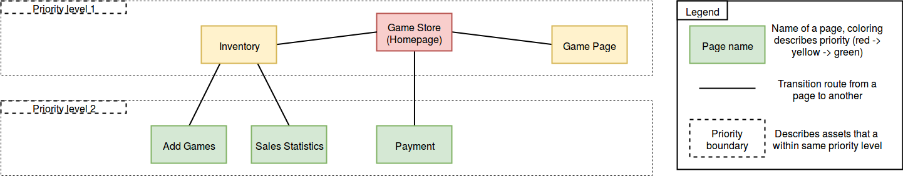

# WSD TEAM Carry Hansen Project Plan.
 
### Team
* Hansen Feng **525093**
* Simo Muraja **430706**
* Henri Thor-Touch **352318**
 
### Goal
A working implementation of an online game store for javascript games.
Game store is a platform where you can sell, buy and play games.
As an example, miniclip with the ability to buy games. 

### Priorities
At the start, we will focus on the homepage(game store) implementation. 
After that we will build views for both developer and gamer inventories, and the game page view where you can play purchased javascript games. When the major views, described above, are done, we start to implement the core features such as, adding games, paying for games and displaying sale statistics.

### Process and Time Schedule
#### Process
We’ll be using git flow as a work model. In Git Flow a master branch is used along with separate feature branches for each feature. Merging a feature branch to master requires a validation from another member during a code review. This practice is used to make sure that master doesn’t break down.
#### Time schedule
Work will be started in the beginning of the third period. We’ll be working together twice a week for two hours each working session. These sessions focus on teamwork and supporting each other and ensuring project flow. In addition group members will be working independently on their own time. We’re looking get the basic structure of the project done within a week or two to allow for easy addition of features.

### Testing
To ensure the quality and robustness of the code, Test Driven Development (TDD) will be used. In practice this means that including passing tests should be a requirement for a pull request to be accepted.

Since the group as no prior experience of javascript testing, we've decided to look into Karma and Mocha.js for our testing framework. Back-end will be tested with normal Django tests, using standard Python libraries.

Acceptance testing is done by hand to verify and validate that functional requirements are fulfilled.

### Risk Analysis
Our software architecture has a risk, as the homepage is the central hub, which is linked to every other part. If homepage breaks, we will lose access to these other parts.

Another risk is our inexperience, as none of us has really worked on these kinds of projects we have no experience in scheduling. So there is a risk that we misjudge the work required to implement these features.

### Analysis
#### User Groups
Our user groups are:
* Admin
  * The administrative users who have control over the Game Store.
* Gamer
  * User who comes to the Game Store to buy games and play them in the Game Store.
* Developer
  * User who comes to the Game Store to add their games to the store for sale at their chosen price.

#### Quality Requirements
Our project has three Quality requirements:
* Security
  * Concernred with Databse security (SQL Injection prevention by SQL Recompiling and Input Sanitation)
* Reliability
  * Our service should be operable in error situations and prevent errors from crashing our software.
* Usability
  * Our service should be easy to use and UI be intuitive to provide a pleasant user experience.

#### Architecture Design

#### Element Catalogue
[Element Catalogue](./element_catalogue.pdf)

## Final Report

### Feature List

In this section, we have identified our done features and associated selfevaluation for each identified feature. 

#### Mandatory Requirements

1. **Minimum functional requirements**
  * Registering as a player and developer
  * As a developer: add games to their inventory, see list of game sales
  * As a player: buy games, play games, see game high scores and record their score to it
2. **Authentication**
  * Login, logout and register
    * These features utilize the Django auth module. In addition, we check CSRF tokens for these events. E-mail verification is done via console backend.
    * We suggest full points assessment
3. **Basic player functionalities**
  * Purchasing games is functional and done via Simple Payments Service.
  * You can purchase games within the gameshop. You can also play the games when you own them.
  * You may find games to buy based on filters or see the whole list. You can also see the games you own in a separate inventory page.
    * We suggest full points assessment
4. **Basic developer functionalities**
  * You can add a game (URL) and set price for that game and manage that game (remove, modify)
  * You have a basic game inventory and sales statistics (how many of the developers' games have been bought and when)
  * You are only allowed to modify/add/etc. your own games, and you can only add games to your own inventory.
    * We suggest full points assessment
5. **Game/service interaction**
  * HANSEN PLEASE COMMENT
    * YOUR SUGGESTION FOR POINTS
6. **Quality of Work**
  * Our code aims to be as self commenting as possible, however, since our team members come from different coding backgrounds, achieving truly self commenting code is not possible. Therefore, you may find comments in sections that do not provide self commenting attributes.
  * Templates are used effectively in our project. Most of the pages where we define functionality or preview to follow a same suite, we extend a generic.html template that provides us the basic building blocks by using the Django Template Language. For more complex solutions, we wrote them as regular HTML.
  * User experience is taken into account in various functionalities. Logging out provides automatic redirection, after purchasing a game you can view the details and even launch the game right away. We attempted to minimize the amount of clicks and navigation for our users in our gameshop, without the gameshop resulting as a single-page-app. None of our group members were designers, so we attempted to make the site colourful instead of it being a black and white page with pure focus on functionality. However, we do acknowledge that our site is not up to par with current styling principles and resembles something from the 90's.
  * We conducted most of our tests as user tests by testing all interaction routes a regular user might do within our system. Our tests did not involve mechanical testing with any framework and relied more in user knowledge and user-centric approach. One of our group members has knowledge in the field of usability evaluation and our methods have followed task-oriented test evaluation cases such as Cognitive Walkthroughs throughout the system.
    * Due to not using any testing framework which any programmer at this point should create to lessen the burden, we suggest 90% assessment.
7. **Non-functional requirements**
  * Our project plan and all the documents related to it are visible within this document.
  * Project Manager of this project was assigned to the senior member of this team, Henri Thor-Touch. He coordinated communication, work division and work load division to be equally distributed within the team and peer support to be available at all times. He also managed the direction of the project and scheduled weekly working times and individual working times and tasks as needed. Our individual workload can be seen from a separate document within this repository.
  * Our teamwork during the project has been superb and team environment has been relaxing and supporting.
  * Work order has been organized and professional regarding interactions with Aalto Version (Git), despite a few humorous commits and merge requests. We believe humour to be a driving factor in upkeeping motivation while keeping work as professional as possible. We also inspect each other code before merging our branches to master to minimize conflicts. To ensure this, we always merge master branch into our development branches before committing merge requests.
    * Since the project demo is not yet done by the time of this report, we cannot give a total assessment.

#### More Features

1. **Save/load and resolution feature**
  * HANSEN PLEASE COMMENT
    * YOUR SUGGESTION FOR POINTS
2. **Own game**
  * HANSEN PLEASE COMMENT
    * YOUR SUGGESTION FOR POINTS

#### Comments about development process

We are all happy to see the fruits of our labour, to implement our very first web based software solution. However, there were many apects that were not clear enough for us. Here is a few of them:
* Why returning an HttpResponse resulted in a CSRF failure but render did not?
* Why making migrationgs in heroku can break the database and pg:reset could only save the situation?
* Why collecting staticfiles is not an automated process?
Many of these could most likely be configured within some configuration files or scripts, but we did not find enough time to investigate this possibility and instead used our time in thinking of our 'backlog items' to be developed.

There were initial problems with deploying to Heroku and Henri in our group had noticed this early during the project. As with any new and unfamiliar environment, testing the runtime environment changes (from localhost to herokuapp) are important in the early stage of development to ensure the smoothness of future integration process. Henri was assigned with the responsibility of deploying to Heroku and solving any problems related to Heroku deployment.

Simo in our group was tasked with configuring and dealing with Django databases and models related to them. This decision did not make him solely responsible for creating database elements and models within the project, all of the project members were involved in this process. But Simo was the person in charge of the knowledge in case we had any database related problems or questions, he was the domain expert in that field.

Hansen had a passion towards creating a game concept for our gameshop project and we gave him freedom in implementing and integrating his JavaScript game into our project. For Henri and Simo to also learn about the game making process, Hansen had demoed his game project to the team so that the knowledge would not stay as a mystery to them.

#### Working times
[Working times](./workingtimes.pdf)

#### Testing our system

In both Heroku and our local Django, our superuser credentials are:
>Username: admin
>Password: adminadmin

Our Heroku app's address: [G621 Gameshop](https://g621.herokuapp.com)

In our project, we highly suggest you create your own account instead of using the admin account to get the first time use feeling. 
* From the **Login** header link, you can register your new account.
* You are not required to activate your account. Activation of the does not affect any of the functionality as we use the console backend to send activation e-mails.
* You do not require credits in order to purchase a game. Even if this would not be a real life solution, we thought for making the testing of the project as easy as possible and focusing on the core functionalities, adding and substracting credits is not implemented (and this is not in the mandatory requirements).
* We hope you explore our gameshop and create both a regular gamer user and a developer user. Navigating through the links and seeing the functionalities through the User Interface should give a clear message of what you can do, where you can navigate and what actions are available to you. 
